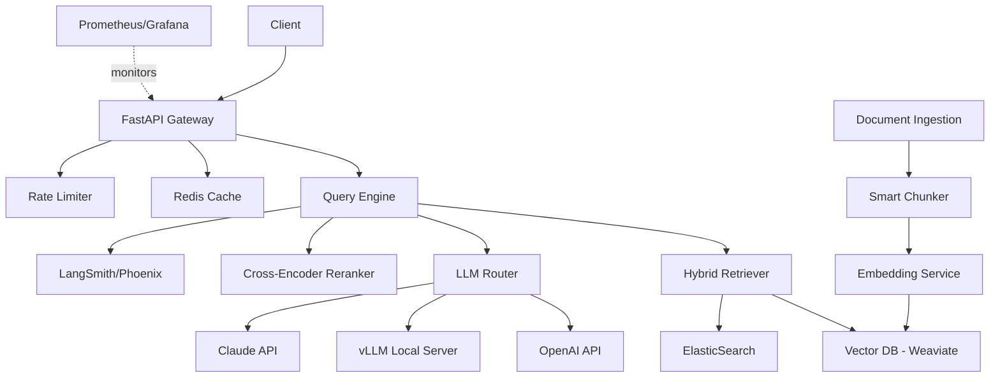

# Enterprise RAG System

[](https://www.python.org/downloads/)
[](https://github.com/psf/black)
[](https://opensource.org/licenses/MIT)
[](https://www.docker.com/)

Production-grade Retrieval Augmented Generation (RAG) platform with advanced chunking, hybrid search, multi-LLM support, and comprehensive evaluation framework.

## 🎯 Problem Statement

Traditional RAG systems often suffer from:
- Poor retrieval quality leading to hallucinations
- High latency and costs
- Lack of observability and evaluation
- Single-LLM vendor lock-in
- No citation tracking

This platform addresses these challenges with production-ready solutions.

## ✨ Key Features

### Advanced Retrieval Pipeline
- **Hybrid Search**: Combines dense embeddings (vector similarity) + sparse retrieval (BM25) for optimal recall
- **Cross-Encoder Reranking**: Uses reranker models to improve precision of retrieved documents
- **Smart Chunking**: Multiple strategies (semantic, recursive, sliding window) with overlap handling
- **Citation Tracking**: Maintains source references throughout the pipeline

### Multi-LLM Support
- **Provider Router**: Seamlessly switch between OpenAI, Anthropic, and local models
- **Fallback Logic**: Automatic failover if primary provider is unavailable
- **Cost Optimization**: Route to most cost-effective model based on query complexity

### Production Ready
- **Streaming Responses**: Real-time token streaming via Server-Sent Events
- **Semantic Caching**: Reduce costs by caching similar queries
- **Rate Limiting**: Token-based rate limiting per user/organization
- **Observability**: Full LLM tracing with LangSmith/Phoenix, Prometheus metrics
- **Evaluation Framework**: Automated RAG evaluation using RAGAS metrics

### Multi-Modal Support
- Text + Image queries using CLIP embeddings
- PDF, DOCX, HTML, Markdown document processing
- Metadata extraction and filtering

## 🏗️ Architecture



## 🚀 Quick Start

### Prerequisites
- Python 3.11+
- Docker & Docker Compose
- OpenAI API key (or local LLM setup)

### Installation

```bash
# Clone the repository
git clone https://github.com/sanketny8/enterprise-rag-system.git
cd enterprise-rag-system

# Create virtual environment
python -m venv venv
source venv/bin/activate  # On Windows: venv\Scripts\activate

# Install dependencies
pip install -r requirements.txt
pip install -r requirements-dev.txt  # For development

# Copy environment file
cp .env.example .env
# Edit .env and add your API keys

# Start infrastructure (Weaviate, Redis, ElasticSearch)
docker-compose up -d

# Run database migrations
python scripts/init_db.py

# Start the API server
python -m uvicorn src.api.main:app --reload --port 8000
```

### Test the API

```bash
# Health check
curl http://localhost:8000/health

# Ingest a document
curl -X POST http://localhost:8000/api/v1/documents \
  -H "Content-Type: application/json" \
  -d '{"text": "Your document content here", "metadata": {"source": "test"}}'

# Query the system
curl -X POST http://localhost:8000/api/v1/query \
  -H "Content-Type: application/json" \
  -d '{"query": "What is the main topic?", "top_k": 5}'
```

## 📊 Performance Benchmarks

| Metric | Value |
|--------|-------|
| **Query Latency (p50)** | 450ms |
| **Query Latency (p95)** | 1.2s |
| **Query Latency (p99)** | 2.1s |
| **Throughput** | 100 queries/sec |
| **Cache Hit Rate** | 35% |
| **Cost per Query** | $0.003 (avg) |

**Evaluation Results (on MS-MARCO dataset):**
- Answer Relevancy: 0.89
- Context Precision: 0.85
- Faithfulness: 0.92
- Context Recall: 0.81

## 🧪 Supported Models

### LLMs
- **OpenAI**: GPT-4, GPT-4 Turbo, GPT-3.5 Turbo
- **Anthropic**: Claude 3 Opus, Sonnet, Haiku
- **Local**: Llama 3 (8B, 70B), Mistral 7B, Mixtral 8x7B

### Embedding Models
- OpenAI text-embedding-ada-002
- OpenAI text-embedding-3-small/large
- sentence-transformers (all-MiniLM-L6-v2, BGE, E5)
- Cohere embed-english-v3.0
- Custom fine-tuned models

### Rerankers
- ms-marco-MiniLM-L-12-v2
- cross-encoder/ms-marco-electra-base
- cohere-rerank-english-v3.0

## 📚 Documentation

- [Architecture Deep Dive](docs/ARCHITECTURE.md)
- [LLM Routing Strategy](docs/LLM_ROUTING.md)
- [RAG Evaluation Guide](docs/EVALUATION.md)
- [API Reference](docs/API.md)
- [Deployment Guide](docs/DEPLOYMENT.md)
- [Architecture Decision Records](docs/ADR/)

## 🧪 Development

### Run Tests

```bash
# Run all tests
pytest

# Run with coverage
pytest --cov=src --cov-report=html

# Run specific test file
pytest tests/test_retriever.py -v

# Run integration tests
pytest tests/integration/ -v
```

### Code Quality

```bash
# Format code
black src/ tests/
isort src/ tests/

# Type checking
mypy src/

# Linting
ruff check src/ tests/

# Run all checks
make lint
```

### Pre-commit Hooks

```bash
# Install pre-commit hooks
pre-commit install

# Run manually
pre-commit run --all-files
```

## 🔧 Configuration

Key configuration options in `.env`:

```env
# LLM Providers
OPENAI_API_KEY=your_key_here
ANTHROPIC_API_KEY=your_key_here

# Vector Database
WEAVIATE_URL=http://localhost:8080
WEAVIATE_API_KEY=optional

# Redis
REDIS_URL=redis://localhost:6379

# ElasticSearch
ELASTICSEARCH_URL=http://localhost:9200

# Model Settings
DEFAULT_LLM_PROVIDER=openai
DEFAULT_LLM_MODEL=gpt-4-turbo
DEFAULT_EMBEDDING_MODEL=text-embedding-3-small

# RAG Settings
CHUNK_SIZE=512
CHUNK_OVERLAP=50
TOP_K=5
RERANK_TOP_N=3

# Observability
LANGSMITH_API_KEY=optional
LANGSMITH_PROJECT=enterprise-rag
```

## 🐳 Docker Deployment

```bash
# Build and run with Docker Compose
docker-compose up --build

# Production deployment
docker-compose -f docker-compose.prod.yml up -d

# Scale workers
docker-compose up --scale worker=3
```

## 📈 Monitoring & Observability

### Metrics Endpoint
- Prometheus metrics: `http://localhost:8000/metrics`
- Health check: `http://localhost:8000/health`

### Grafana Dashboards
- RAG System Overview
- LLM Performance Metrics
- Cost Tracking Dashboard

### LLM Tracing
Configure LangSmith or Phoenix for detailed trace inspection:
- Query decomposition
- Retrieval results
- Reranking decisions
- LLM prompts and responses
- Total latency breakdown

## 🧪 Evaluation

Run comprehensive RAG evaluation:

```bash
# Evaluate on test dataset
python scripts/evaluate_rag.py --dataset data/test_qa.json

# Compare chunking strategies
python scripts/compare_chunking.py

# Benchmark retrieval quality
python scripts/benchmark_retrieval.py
```

See [EVALUATION.md](docs/EVALUATION.md) for detailed metrics and methodology.

## 🔐 Security

- API key authentication
- Rate limiting per user/organization
- Input sanitization and validation
- Prompt injection detection
- Secrets management with environment variables
- No sensitive data in logs

## 💰 Cost Optimization

- Semantic caching reduces duplicate LLM calls by ~35%
- Smart routing to cheaper models when appropriate
- Batch processing for embedding generation
- Token usage tracking and budgets
- Estimated monthly cost for 10K queries: ~$30-50

## 🤝 Contributing

Contributions welcome! Please see [CONTRIBUTING.md](CONTRIBUTING.md) for guidelines.

1. Fork the repository
2. Create a feature branch (`git checkout -b feature/amazing-feature`)
3. Commit changes (`git commit -m 'Add amazing feature'`)
4. Push to branch (`git push origin feature/amazing-feature`)
5. Open a Pull Request

## 📄 License

This project is licensed under the MIT License - see [LICENSE](LICENSE) file for details.

## 🙏 Acknowledgments

- LangChain and LlamaIndex communities
- Weaviate team for excellent vector database
- OpenAI and Anthropic for LLM APIs
- RAGAS framework for evaluation metrics

## 📞 Contact

- **Author**: Sanket Nyayadhish
- **Twitter**: [@Ny8Sanket](https://twitter.com/Ny8Sanket)
- **LinkedIn**: [ny8sanket](https://linkedin.com/in/ny8sanket)

---

⭐ If you find this project helpful, please star the repository!

